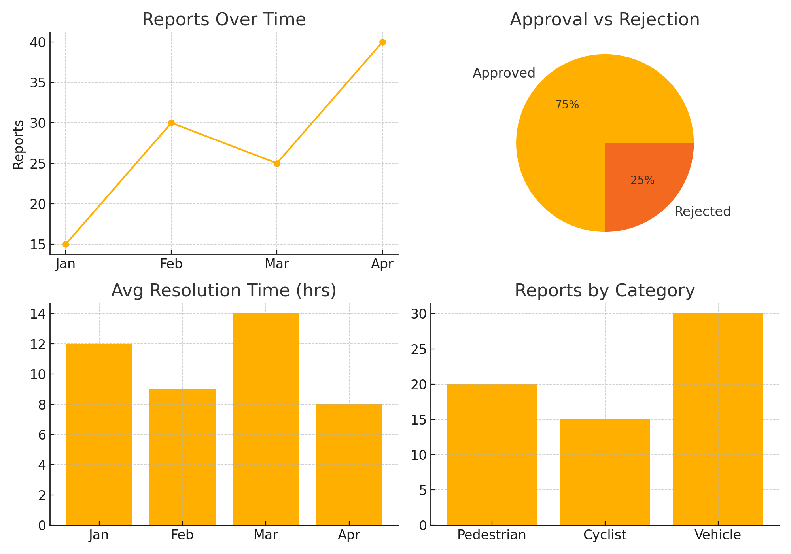

# 📊 Analytics Dashboard

The **Analytics Dashboard** provides insights into reports, moderation activity, and trends.

## Dashboard Mockup

## Features

- **Reports Over Time** → Track number of accident/near-miss reports submitted monthly.  
- **Approval vs Rejection Rates** → Ratio of reports approved vs rejected by moderators.  
- **Average Resolution Time** → Monitor how quickly flagged reports or comments are handled.  
- **Reports by Category** → Breakdown of reports by pedestrian, cyclist, and motor vehicle incidents.  

---

## Future Enhancements
- Moderator performance leaderboard (actions, resolution time).  
- Heatmap overlay for geospatial clustering of incidents.  
