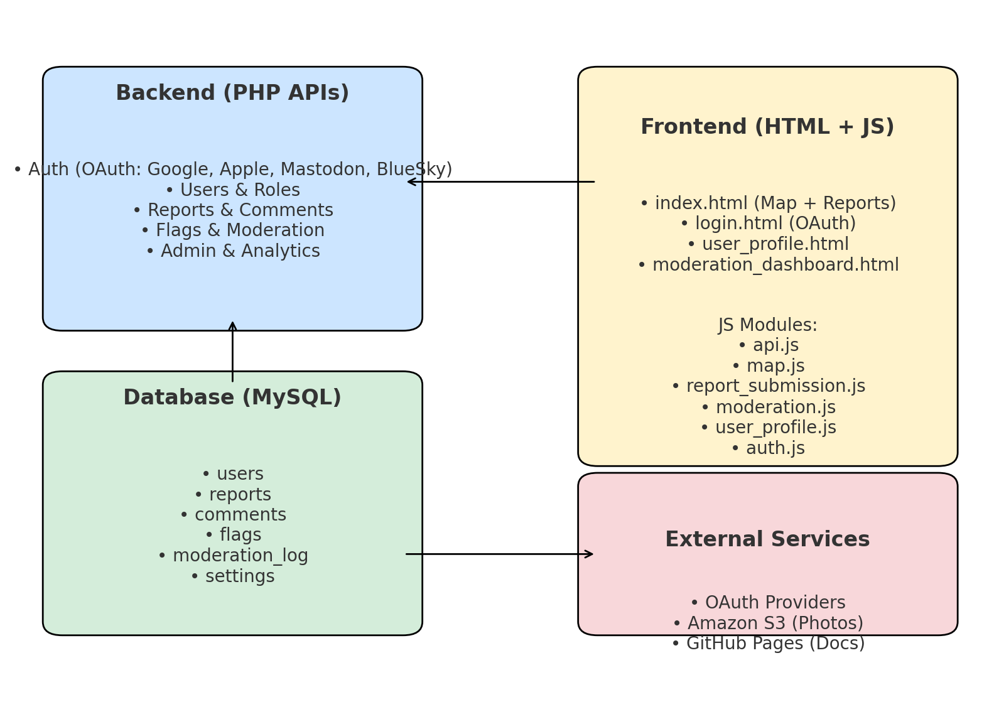
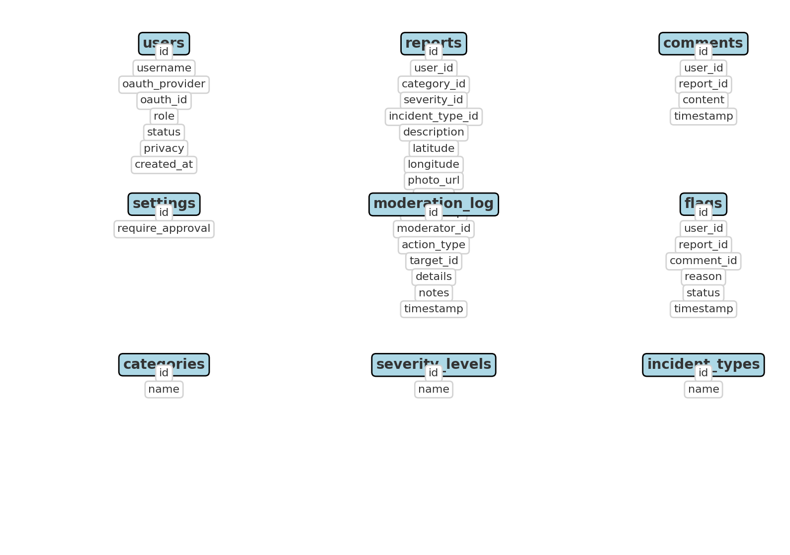
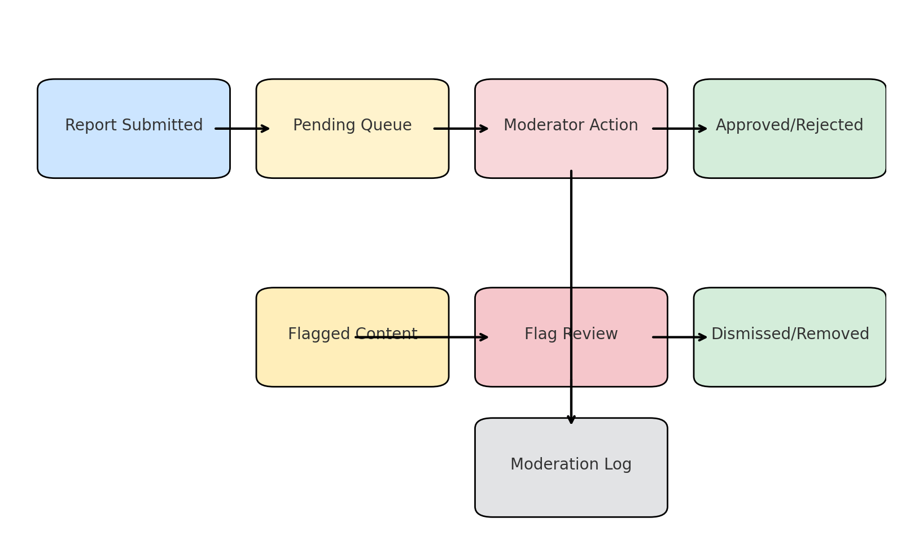
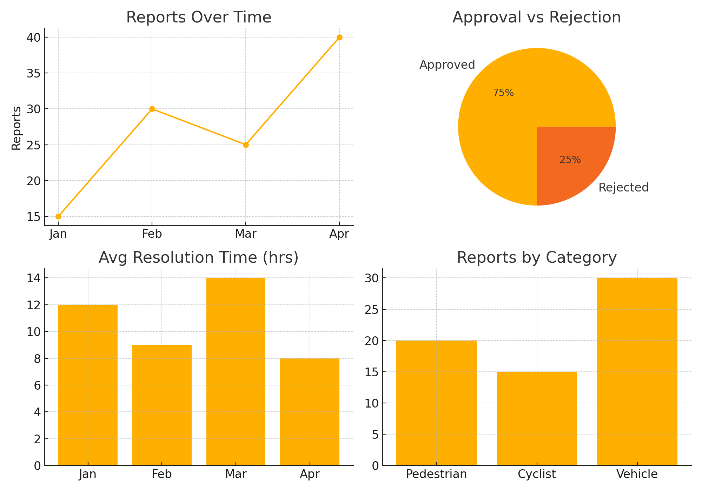

# 🏗️ System Architecture

The Edmonton Accident & Near Miss Reporting Platform is built as a **web-first application** with a modular backend and frontend.

---

## 🌐 High-Level Overview

- **Backend (PHP APIs)** → Authentication, reports, moderation, analytics  
- **Frontend (HTML + JS)** → Interactive map, dashboards, user profiles  
- **Database (MySQL)** → Normalized schema with users, reports, moderation logs  
- **External Services** → OAuth providers, Amazon S3 for file uploads, GitHub Pages for docs  

---

## 🗃️ Database Schema

The schema ensures normalization and accountability through:  
- Users → roles, privacy, and OAuth login mapping  
- Reports → structured categories, severity, and incident types  
- Moderation log → immutable audit trail  

---

## 🛡️ Moderation Workflow

Reports and comments follow a structured review process:  
- Pending → Approved/Rejected  
- Flagged → Dismissed/Removed  
- All actions logged immutably  

---

## 📊 Analytics Dashboard

Admins and moderators get insights into:  
- Report trends  
- Approval/rejection ratios  
- Resolution times  
- Reports by category  

---

## 🔒 Design Principles

- **Transparency** → Immutable logs for accountability  
- **Security** → OAuth-based login, private profiles, prepared SQL  
- **Scalability** → Modular APIs and structured DB schema  
- **Accessibility** → Map-first design, responsive UI  

---

For implementation details, see:  
- [Developer Guide](developer_guide.md)  
- [Database Schema](database.md)  
- [Moderation Workflow](moderation.md)  
