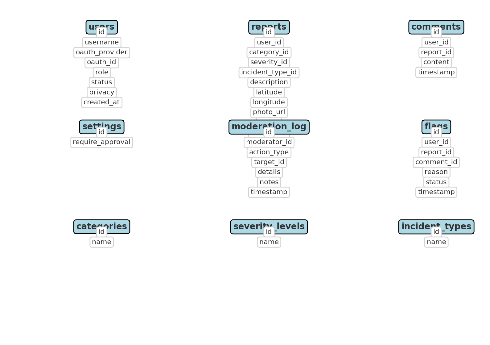

# 🗃️ Database Schema

This project uses a **MySQL database** with normalized tables for users, reports, moderation, and analytics.

## Entity Relationship Diagram (ERD)

## Key Tables
- **users** → Stores user accounts, roles, and privacy settings
- **reports** → Accident & near miss reports with categories, severity, and status
- **comments** → User comments linked to reports
- **flags** → User-submitted content flags (reports or comments)
- **moderation_log** → Immutable record of moderation actions
- **settings** → System-wide settings (e.g., require approval toggle)
- **categories, severity_levels, incident_types** → Reference data for reports

---

For details, see the schema in [seed.sql](../sql/seed.sql).
